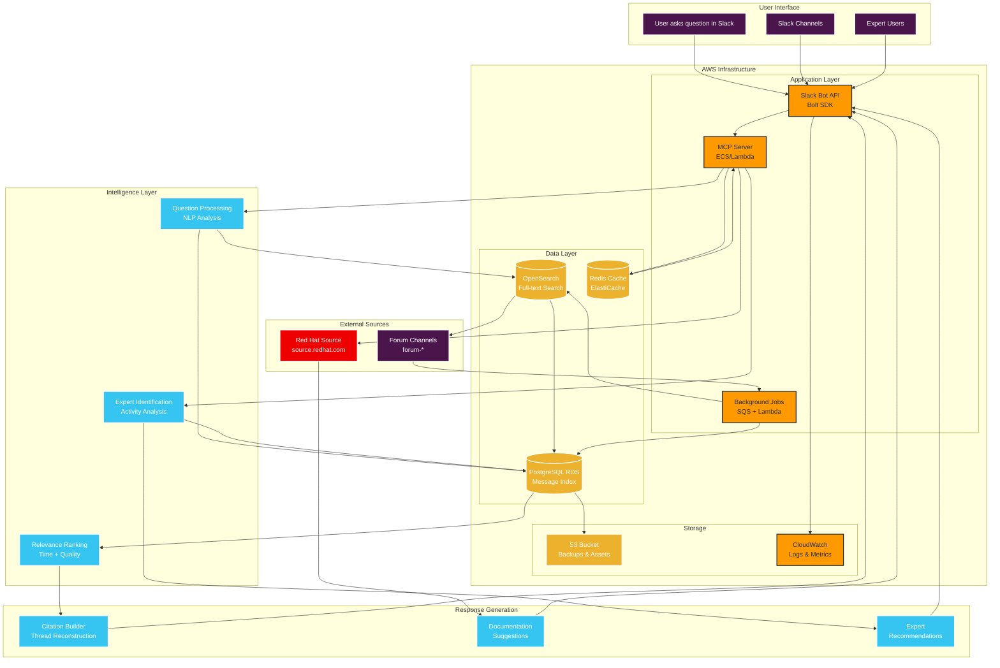
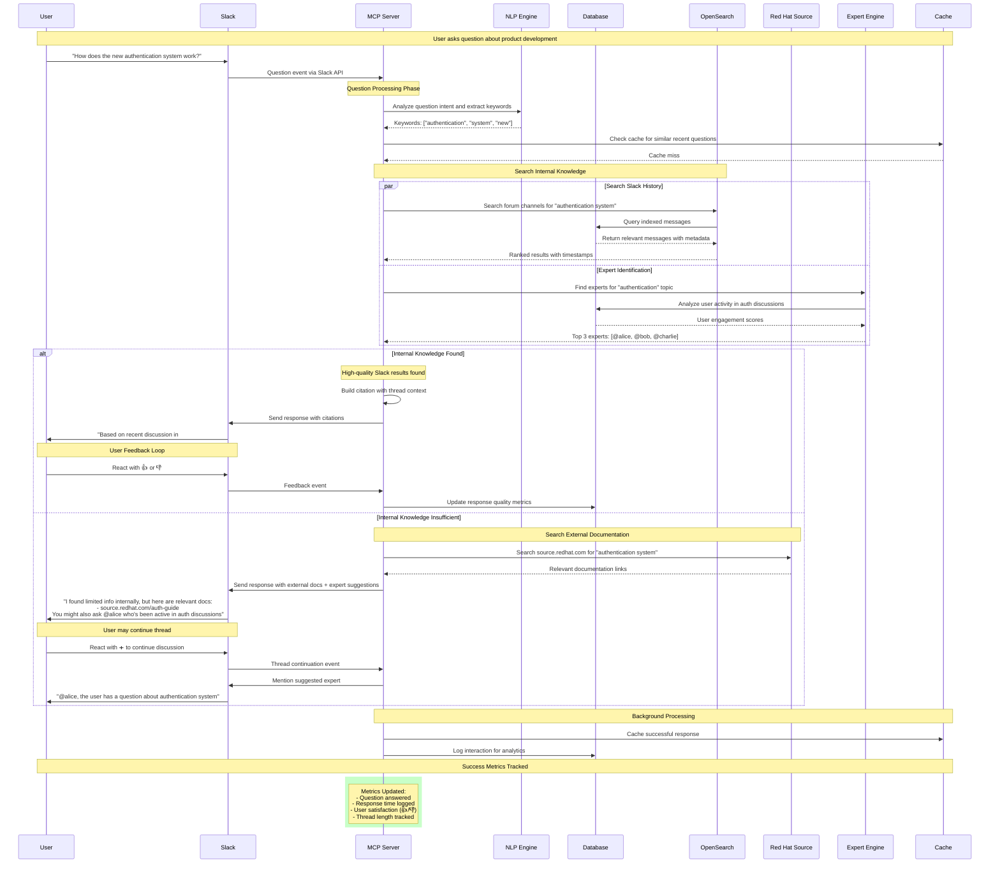

# Project Proposal: Slack Q&A MCP Bot

## 1. Project Overview

**Problem Statement**: Customer Support Team, New Users, and Developers are struggling to access timely information about products under development, bug support, and customer requests on Slack, leading to repeated requests, frustration, and productivity loss.

**Solution**: Build a centralized MCP (Model Context Protocol) application that provides intelligent Q&A capabilities by:
- Searching and citing existing Slack channel messages (prioritizing recent information)
- Suggesting external documentation when internal knowledge gaps exist
- Recommending subject matter experts based on chat history analysis
- Focusing on open "forum-" channels for privacy compliance

## 2. Technical Architecture

### Core Components:
1. **MCP Server**: Main application handling Q&A logic and Slack integration
2. **Slack Integration Layer**: Bot API integration for message processing and responses
3. **Message Database**: Indexed storage of forum channel messages with metadata
4. **Expert Discovery Engine**: Analysis system for identifying subject matter experts
5. **External Documentation Connector**: Integration with Red Hat source.redhat.com
6. **Analytics & Metrics Tracker**: Usage and success metrics collection

### Technology Stack:
- **Backend**: Python with MCP SDK
- **Database**: PostgreSQL with full-text search capabilities
- **Slack Integration**: Slack Bolt SDK for Python
- **Message Processing**: Background job processing with SQS/Lambda
- **Search**: Amazon OpenSearch Service for advanced text search
- **Analytics**: Built-in metrics collection with dashboard
- **Infrastructure**: AWS (ECS, RDS, OpenSearch, SQS, Lambda, S3, CloudWatch)

### External Documentation Integration:
- **Primary Source**: https://source.redhat.com/
- **Integration Strategy**: Web scraping or API integration with Red Hat's internal documentation
- **Authentication**: Handle Red Hat SSO/authentication for source.redhat.com access
- **Fallback Behavior**: When Slack history lacks answers, search and suggest relevant source.redhat.com articles

## 3. System Architecture Diagrams

### 3.1 Overall Architecture

### 3.2 User Interaction Flow

## 4. Key Features & Functionality

### 4.1 Intelligent Q&A System
- **Natural Language Processing**: Understand user questions and extract key topics
- **Context-Aware Search**: Search forum channels with semantic understanding
- **Relevance Ranking**: Prioritize newer messages and higher-quality responses
- **Thread Reconstruction**: Present relevant message threads with proper context

### 4.2 Expert Identification
- **Activity Analysis**: Track user participation in specific topics over time
- **Quality Scoring**: Analyze reaction patterns (👍, ✅, etc.) to identify helpful contributors
- **Domain Expertise**: Map users to subject areas based on their contribution history
- **Availability Heuristics**: Consider recent activity when suggesting experts

### 4.3 External Documentation Integration
- **Knowledge Gap Detection**: Identify when internal Slack history is insufficient
- **Red Hat Source Integration**: Search and suggest relevant source.redhat.com documentation
- **Link Validation**: Ensure suggested resources are current and accessible
- **Authentication Handling**: Manage Red Hat SSO integration for documentation access

### 4.4 Privacy & Security
- **Channel Filtering**: Only access channels with "forum-" prefix
- **Permission Respect**: Honor Slack's native permission system
- **Data Anonymization**: Store only necessary metadata, not personal information
- **Audit Trail**: Log all bot interactions for compliance and improvement

## 5. Implementation Phases

### Phase 1: Foundation (Weeks 1-2)
- Set up AWS infrastructure and MCP server framework
- Implement basic Slack bot integration
- Create Red Hat source.redhat.com connector
- Build basic Q&A query processing

### Phase 2: Core Features (Weeks 3-4)
- Implement message indexing system for forum channels
- Add intelligent search and ranking algorithms
- Create thread reconstruction and citation capabilities
- Build expert identification system

### Phase 3: Enhancement (Weeks 5-6)
- Add advanced natural language processing
- Implement learning from user feedback (👍👎 reactions)
- Create analytics dashboard
- Add configuration management for admins

### Phase 4: Polish & Deploy (Weeks 7-8)
- Comprehensive testing and bug fixes
- Performance optimization
- Documentation and training materials
- Production deployment and monitoring setup

## 6. Success Metrics & Monitoring

### Primary Metrics:
1. **Usage Metrics**:
   - Number of questions asked per day/week
   - Number of active users
   - Question resolution rate

2. **Quality Metrics**:
   - Positive feedback ratio (👍 reactions)
   - Negative feedback ratio (👎 reactions)
   - Thread length before resolution (➕ reactions)

3. **Efficiency Metrics**:
   - Average response time
   - Reduction in duplicate questions
   - Expert engagement rate

### Monitoring Dashboard:
- Real-time usage statistics
- Weekly/monthly trend analysis
- User satisfaction scores
- System performance metrics

## 7. Technical Considerations

### 7.1 AWS Architecture
- **Compute**: ECS or Lambda for the MCP server
- **Database**: RDS (PostgreSQL) for message storage
- **Search**: Amazon OpenSearch Service for advanced text search
- **Queue**: SQS for background job processing
- **Storage**: S3 for backups and static assets
- **Monitoring**: CloudWatch for metrics and logging
- **Cache**: ElastiCache (Redis) for performance optimization

### 7.2 Scalability
- Design for horizontal scaling as organization grows
- Efficient indexing for large message volumes
- Caching strategies for frequently accessed information

### 7.3 Integration Points
- Slack Events API for real-time message processing
- Slack Web API for bot responses and interactions
- Red Hat source.redhat.com authentication and content access
- Webhook endpoints for external documentation systems

## 8. Risk Mitigation

### Technical Risks:
- **Slack API Rate Limits**: Implement proper throttling and queueing
- **Data Volume**: Use efficient indexing and search strategies
- **Bot Accuracy**: Implement feedback loops and continuous improvement
- **Red Hat Source Access**: Handle authentication and content parsing robustly

### Business Risks:
- **User Adoption**: Engage early adopters and gather feedback
- **Privacy Concerns**: Strict adherence to open channel policy
- **Maintenance**: Plan for ongoing updates and improvements

## 9. Timeline & Milestones

**Total Duration**: 8 weeks

### Key Milestones:
- Week 2: Basic bot responds to simple queries with Red Hat source integration
- Week 4: Full Q&A system with expert recommendations and Slack indexing
- Week 6: Analytics and feedback system operational
- Week 8: Production-ready deployment on AWS

## 10. Resource Requirements

### Development:
- 1 Senior Developer (Full-time)
- Access to Slack workspace and admin permissions
- Red Hat source.redhat.com access and authentication setup
- AWS account with appropriate permissions
- Development and staging environments

### Infrastructure:
- AWS hosting (ECS, RDS, OpenSearch, SQS, Lambda, S3, CloudWatch)
- SSL certificates and security tools
- Monitoring and logging services
- Red Hat SSO integration

## 11. Architecture Benefits

### Key Architectural Highlights:
1. **Scalable AWS Infrastructure**: Uses managed services for reliability and scalability
2. **Intelligent Search**: Combines full-text search with relevance ranking based on recency and quality
3. **Multi-Source Knowledge**: Searches both internal Slack history and Red Hat documentation
4. **Privacy-First Design**: Only accesses forum channels, respects Slack permissions
5. **Continuous Learning**: Feedback loops improve responses over time
6. **Expert Discovery**: Identifies SMEs based on actual participation and helpfulness

The architecture addresses the specific challenges mentioned in your requirements:
- **Reduce repeated requests** through intelligent caching and search
- **Surface existing knowledge** through comprehensive indexing
- **Suggest experts** when information gaps exist
- **Maintain privacy** by only accessing open forum channels
- **Integrate Red Hat resources** for comprehensive knowledge coverage

## 12. Next Steps

1. **Approval**: Review and approve this proposal
2. **AWS Setup**: Configure AWS infrastructure and services
3. **Slack App Configuration**: Set up bot permissions and webhook endpoints
4. **Red Hat Integration**: Configure source.redhat.com access and authentication
5. **Development**: Begin Phase 1 implementation
6. **Testing**: Ongoing testing with select user groups

---

**Ready to proceed with implementation using this comprehensive architecture and plan.** 