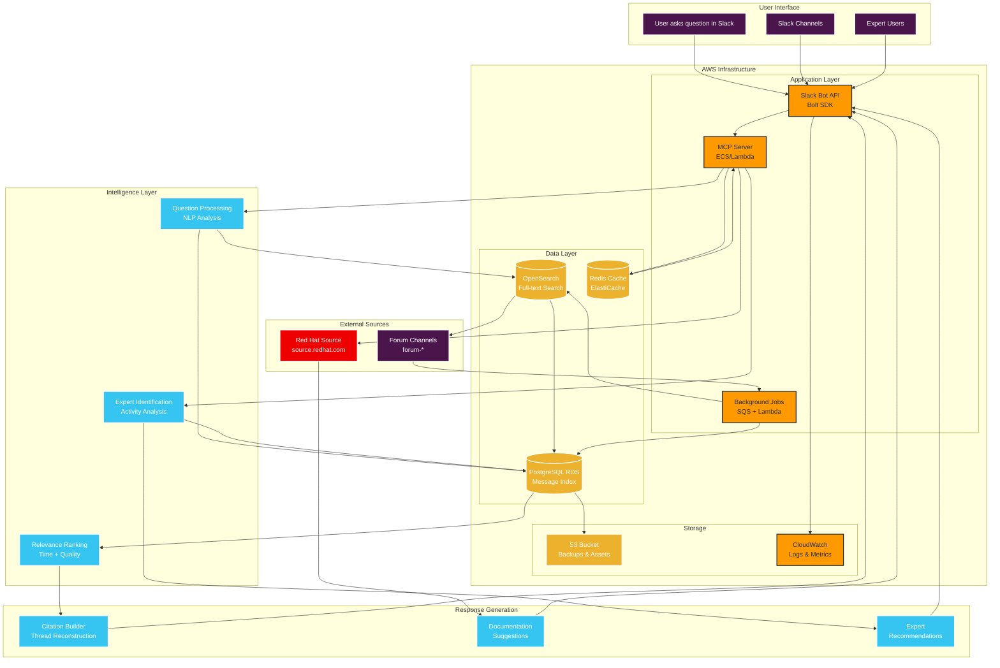
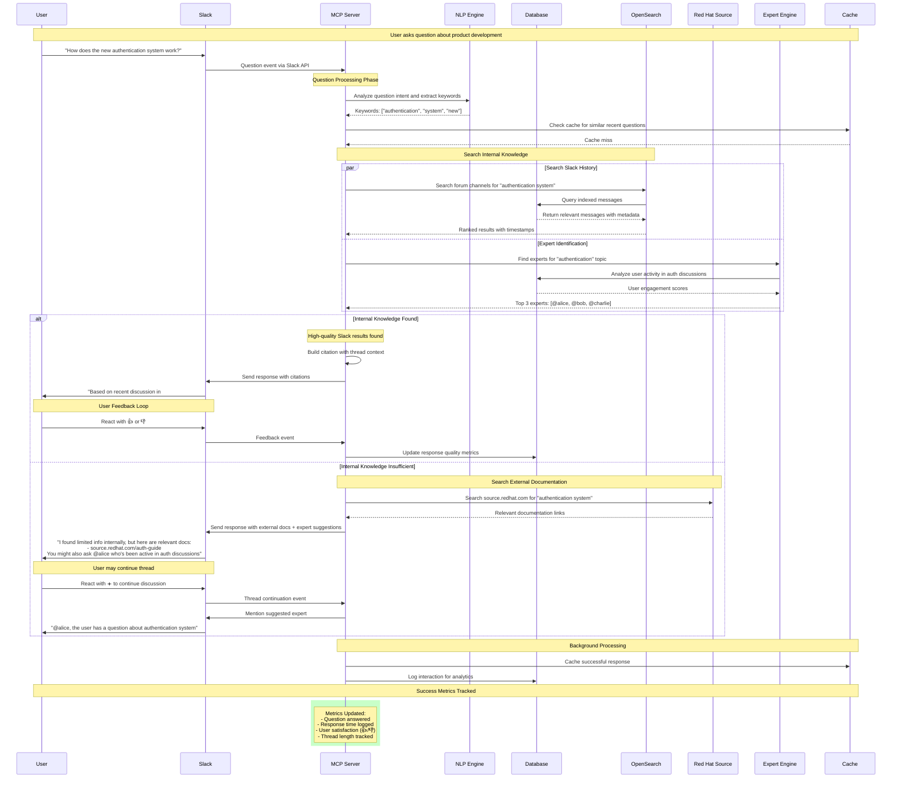

# Project Proposal: Slack Q&A MCP Bot

## 1. Project Overview

**Problem Statement**: Customer Support Team, New Users, and Developers are struggling to access timely information about products under development, bug support, and customer requests on Slack, leading to repeated requests, frustration, and productivity loss.

**Solution**: Build a centralized MCP (Model Context Protocol) application that provides intelligent Q&A capabilities by:
- Searching and citing existing Slack channel messages (prioritizing recent information)
- Suggesting external documentation when internal knowledge gaps exist
- Recommending subject matter experts based on chat history analysis
- Focusing on open "forum-" channels for privacy compliance

**Strategic Approach**: Phased implementation using Red Hat OpenShift to minimize initial investment while enabling enterprise-scale growth:
- **Phase 1**: MVP with $120/month infrastructure (4 weeks)
- **Phase 2+**: Scale based on proven value and user adoption
- **Year 1 Savings**: $34,180-36,080 (57-60% cost reduction)
- **Red Hat Ecosystem**: Fully integrated with existing infrastructure

## 2. Technical Architecture

### Core Components:
1. **MCP Server**: FastMCP-based application handling Q&A logic and protocol management
2. **Slack Integration Layer**: Slack Bolt SDK for bot API integration and message processing
3. **Message Database**: Indexed storage of forum channel messages with metadata
4. **Expert Discovery Engine**: Analysis system for identifying subject matter experts
5. **External Documentation Connector**: Integration with Red Hat source.redhat.com
6. **Analytics & Metrics Tracker**: Usage and success metrics collection

### MCP Server Implementation:

#### **FastMCP Framework** (Official Python MCP SDK)
- **Framework**: Anthropic's official FastMCP implementation
- **Protocol Handling**: Automatic MCP protocol compliance and message routing
- **Transport Support**: stdio, SSE, and Streamable HTTP for flexible deployment
- **Built-in Features**: Resource management, tool execution, prompt handling, and lifecycle management

#### **Server Architecture**
```python
from mcp.server.fastmcp import FastMCP

# Create the MCP server
mcp = FastMCP("Slack Q&A Bot")

# Core Q&A functionality
@mcp.tool()
def search_slack_history(query: str, channel_filter: str = None) -> str:
    """Search Slack forum channels for relevant discussions"""
    # Search PostgreSQL database of indexed forum messages
    # Apply relevance ranking based on recency and quality
    return search_results_with_citations

@mcp.tool()
def find_subject_experts(topic: str, activity_threshold: int = 5) -> str:
    """Identify subject matter experts based on forum activity"""
    # Analyze user participation and reaction patterns
    # Return ranked list of experts with availability indicators
    return expert_recommendations

@mcp.resource("slack://forum/{channel_id}")
def get_channel_context(channel_id: str) -> str:
    """Retrieve recent context from specific forum channels"""
    # Fetch and format recent channel discussions
    return channel_summary

@mcp.tool()
def search_redhat_docs(query: str, doc_type: str = "all") -> str:
    """Search Red Hat source.redhat.com documentation"""
    # Interface with Red Hat documentation API
    # Return relevant documentation links and summaries
    return documentation_results

@mcp.prompt()
def generate_expert_introduction(expert_name: str, topic: str) -> str:
    """Generate contextual expert introduction for @mentions"""
    return f"@{expert_name}, we have a question about {topic} that matches your expertise..."
```

#### **Key Benefits for Our Implementation**
- **Rapid Development**: FastMCP abstracts protocol complexities, accelerating development
- **OpenShift Native**: Containerizes easily for OpenShift deployment
- **Slack Integration**: Clean separation between MCP logic and Slack Bolt SDK
- **Scalable Architecture**: Supports horizontal scaling and multiple transport methods
- **Built-in Analytics**: Native support for logging, metrics, and monitoring
- **Context Management**: Sophisticated context handling for conversation continuity

#### **Development Workflow**
1. **Phase 1**: Basic FastMCP server with essential tools (search, experts, docs)
2. **Phase 2**: Enhanced resource management and caching strategies
3. **Phase 3**: Advanced analytics tools and performance optimization
4. **Phase 4**: Machine learning integration and predictive capabilities

#### **Installation & Deployment**
```bash
# Install the official MCP SDK
pip install "mcp[cli]"

# Or with uv (recommended for faster package management)
uv add "mcp[cli]"

# Development and testing
uv run mcp dev slack_qa_server.py

# Production deployment on OpenShift
# The FastMCP server will be containerized and deployed as a pod
# with configurable transport (stdio/SSE/Streamable HTTP)
```

#### **FastMCP Server Benefits for OpenShift Deployment**
- **Container Ready**: FastMCP applications containerize seamlessly
- **Multiple Transports**: Supports stdio, SSE, and Streamable HTTP for different deployment scenarios
- **Health Checks**: Built-in health monitoring for Kubernetes/OpenShift readiness probes
- **Configuration Management**: Environment-based configuration for different deployment stages
- **Horizontal Scaling**: FastMCP servers can be scaled horizontally across multiple pods

### Technology Stack:
- **MCP Server**: Official Python MCP SDK with FastMCP implementation
- **Backend**: Python with Slack Bolt SDK for Python
- **Database**: PostgreSQL with full-text search capabilities (OpenShift-hosted)
- **Message Processing**: Background job processing with SQS/Lambda
- **Search**: PostgreSQL full-text search (Phase 1), Self-managed Elasticsearch (Phase 3+)
- **Analytics**: Built-in metrics collection with dashboard
- **Infrastructure**: Red Hat OpenShift on AWS (ROSA) + AWS managed services
- **Approach**: Phased implementation starting with MVP

### External Documentation Integration:
- **Primary Source**: https://source.redhat.com/
- **Integration Strategy**: Web scraping or API integration with Red Hat's internal documentation
- **Authentication**: Handle Red Hat SSO/authentication for source.redhat.com access
- **Fallback Behavior**: When Slack history lacks answers, search and suggest relevant source.redhat.com articles

## 3. System Architecture Diagrams

### 3.1 Overall Architecture



### 3.2 User Interaction Flow



## 4. Key Features & Functionality

### 4.1 Intelligent Q&A System
- **Natural Language Processing**: Understand user questions and extract key topics
- **Context-Aware Search**: Search forum channels with semantic understanding
- **Relevance Ranking**: Prioritize newer messages and higher-quality responses
- **Thread Reconstruction**: Present relevant message threads with proper context

### 4.2 Expert Identification
- **Activity Analysis**: Track user participation in specific topics over time
- **Quality Scoring**: Analyze reaction patterns (👍, ✅, etc.) to identify helpful contributors
- **Domain Expertise**: Map users to subject areas based on their contribution history
- **Availability Heuristics**: Consider recent activity when suggesting experts

### 4.3 External Documentation Integration
- **Knowledge Gap Detection**: Identify when internal Slack history is insufficient
- **Red Hat Source Integration**: Search and suggest relevant source.redhat.com documentation
- **Link Validation**: Ensure suggested resources are current and accessible
- **Authentication Handling**: Manage Red Hat SSO integration for documentation access

### 4.4 Privacy & Security
- **Channel Filtering**: Only access channels with "forum-" prefix
- **Permission Respect**: Honor Slack's native permission system
- **Data Anonymization**: Store only necessary metadata, not personal information
- **Audit Trail**: Log all bot interactions for compliance and improvement

## 5. Implementation Phases

### Phase 1: MVP (Weeks 1-4) - $120/month
**Goal**: Prove concept with minimal investment (10-50 users)
- Set up OpenShift cluster (single node) and PostgreSQL
- Implement FastMCP server with essential tools:
  - `search_slack_history()` - Basic forum channel search
  - `find_subject_experts()` - Simple expert identification
  - `search_redhat_docs()` - Red Hat documentation integration
- Integrate with Slack using Bolt SDK
- PostgreSQL full-text search implementation
- Basic analytics and logging

### Phase 2: Growth (Weeks 5-8) - $200/month
**Goal**: Scale for broader adoption (50-200 users)
**Trigger**: 40+ daily active users OR 80% positive feedback
- Scale OpenShift cluster (2 nodes) with high availability
- Enhanced FastMCP server features:
  - `get_channel_context()` resource for channel summaries
  - `generate_expert_introduction()` prompt for better @mentions
  - Advanced caching with Redis integration
  - Improved expert scoring algorithms
- Enhanced analytics dashboard with FastMCP built-in metrics
- Performance optimization and response time improvements

### Phase 3: Enterprise (Months 3-6) - $300/month
**Goal**: Enterprise-grade capabilities (200-500 users)
**Trigger**: 150+ daily active users OR department-wide adoption
- Scale OpenShift cluster (3 nodes) with auto-scaling
- Advanced FastMCP server capabilities:
  - Self-managed Elasticsearch integration for enhanced search
  - Advanced resource templates for dynamic content
  - Context-aware completion suggestions
  - Comprehensive monitoring with FastMCP built-in observability
- Multi-region backup and disaster recovery
- Advanced analytics with predictive insights

### Phase 4: Advanced Features (Months 6-12) - $400/month
**Goal**: Advanced AI and enterprise features (500+ users)
**Trigger**: 400+ daily active users OR proven ROI
- Scale OpenShift cluster (4 nodes) for enterprise load
- Advanced AI-powered FastMCP features:
  - Machine learning-enhanced expert recommendations
  - Predictive context suggestions using FastMCP sampling
  - Advanced NLP integration with AWS Comprehend
  - Custom dashboard creation with FastMCP analytics
- Integration with additional Red Hat services and APIs
- Enterprise security features and compliance monitoring

## 6. Success Metrics & Monitoring

### Primary Metrics:
1. **Usage Metrics**:
   - Number of questions asked per day/week
   - Number of active users
   - Question resolution rate

2. **Quality Metrics**:
   - Positive feedback ratio (👍 reactions)
   - Negative feedback ratio (👎 reactions)
   - Thread length before resolution (➕ reactions)

3. **Efficiency Metrics**:
   - Average response time
   - Reduction in duplicate questions
   - Expert engagement rate

### Monitoring Dashboard:
- Real-time usage statistics
- Weekly/monthly trend analysis
- User satisfaction scores
- System performance metrics

## 7. Technical Considerations

### 7.1 AWS Architecture
- **Compute**: ECS or Lambda for the MCP server
- **Database**: RDS (PostgreSQL) for message storage
- **Search**: Amazon OpenSearch Service for advanced text search
- **Queue**: SQS for background job processing
- **Storage**: S3 for backups and static assets
- **Monitoring**: CloudWatch for metrics and logging
- **Cache**: ElastiCache (Redis) for performance optimization

### 7.2 Scalability
- Design for horizontal scaling as organization grows
- Efficient indexing for large message volumes
- Caching strategies for frequently accessed information

### 7.3 Integration Points
- Slack Events API for real-time message processing
- Slack Web API for bot responses and interactions
- Red Hat source.redhat.com authentication and content access
- Webhook endpoints for external documentation systems

## 8. Risk Mitigation

### Technical Risks:
- **Slack API Rate Limits**: Implement proper throttling and queueing
- **Data Volume**: Use efficient indexing and search strategies
- **Bot Accuracy**: Implement feedback loops and continuous improvement
- **Red Hat Source Access**: Handle authentication and content parsing robustly

### Business Risks:
- **User Adoption**: Engage early adopters and gather feedback
- **Privacy Concerns**: Strict adherence to open channel policy
- **Maintenance**: Plan for ongoing updates and improvements

## 9. Timeline & Milestones

**Phased Approach**: Value-driven scaling over 12 months

### Key Milestones:
- **Week 4**: Phase 1 MVP - Basic bot operational with early adopters
- **Week 8**: Phase 2 - Enhanced system supporting 50-200 users
- **Month 6**: Phase 3 - Enterprise-grade capabilities for 200-500 users
- **Month 12**: Phase 4 - Advanced AI features for 500+ users

### Phase Transition Criteria:
- **Phase 1→2**: 40+ daily active users OR 80% positive feedback
- **Phase 2→3**: 150+ daily active users OR department-wide adoption
- **Phase 3→4**: 400+ daily active users OR proven ROI

## 10. Resource Requirements

### Development:
- 1 Senior Developer (Full-time)
- Access to Slack workspace and admin permissions
- Red Hat source.redhat.com access and authentication setup
- AWS account with appropriate permissions
- Red Hat OpenShift subscription (ROSA)

### Infrastructure (Phase 1):
- Red Hat OpenShift cluster (single node)
- AWS managed services (S3, Lambda, CloudWatch)
- SSL certificates and security tools
- Red Hat SSO integration

### Infrastructure (Scaling):
- Additional OpenShift nodes as usage grows
- Enhanced AWS services (ElastiCache, ALB, etc.)
- Advanced monitoring and backup services
- External NLP services (Phase 4)

## 11. Architecture Benefits

### Key Architectural Highlights:
1. **Scalable AWS Infrastructure**: Uses managed services for reliability and scalability
2. **Intelligent Search**: Combines full-text search with relevance ranking based on recency and quality
3. **Multi-Source Knowledge**: Searches both internal Slack history and Red Hat documentation
4. **Privacy-First Design**: Only accesses forum channels, respects Slack permissions
5. **Continuous Learning**: Feedback loops improve responses over time
6. **Expert Discovery**: Identifies SMEs based on actual participation and helpfulness

The architecture addresses the specific challenges mentioned in your requirements:
- **Reduce repeated requests** through intelligent caching and search
- **Surface existing knowledge** through comprehensive indexing
- **Suggest experts** when information gaps exist
- **Maintain privacy** by only accessing open forum channels
- **Integrate Red Hat resources** for comprehensive knowledge coverage

## 12. Cost Estimates

### 12.1 Development Costs

#### Personnel (8 weeks)
- **Senior Developer (Full-time)**: $120,000/year × (8 weeks / 52 weeks) = **$18,460**
- **DevOps Setup & Configuration**: 1 week equivalent = **$2,308**
- **Project Management & Coordination**: 0.5 weeks equivalent = **$1,154**

**Total Development Cost: $21,922**

### 12.2 Operational Costs (AWS Infrastructure)

#### Monthly Operational Costs (Production)

| Service | Configuration | Monthly Cost |
|---------|---------------|-------------|
| **ECS Fargate** | 2 tasks × 1 vCPU, 2GB RAM, 24/7 | $45 |
| **RDS PostgreSQL** | db.t3.medium (2 vCPU, 4GB) | $85 |
| **OpenSearch** | t3.small.search (1 instance) | $75 |
| **ElastiCache Redis** | cache.t3.micro | $15 |
| **Lambda Functions** | 1M requests, 512MB, 3s avg | $25 |
| **SQS** | 10M requests/month | $4 |
| **S3 Storage** | 100GB data + requests | $25 |
| **CloudWatch** | Logs, metrics, dashboards | $20 |
| **Application Load Balancer** | 1 ALB with SSL | $25 |
| **Data Transfer** | 500GB/month | $45 |
| **NAT Gateway** | 1 gateway for private subnets | $45 |

**Total Monthly AWS Cost: $409**
**Annual AWS Cost: $4,908**

#### Development & Staging Environment
- **Monthly Cost**: $150 (scaled-down versions)
- **Annual Cost**: $1,800

### 12.3 Third-Party Services & Licenses

#### Required Services
- **Slack App**: Free (standard workspace)
- **Red Hat Source Access**: Included (existing enterprise license)
- **SSL Certificates**: $50/year (or free with AWS Certificate Manager)
- **Domain Registration**: $15/year (if needed)

#### Optional Enhancements
- **Advanced NLP Service** (AWS Comprehend): $50/month
- **Enhanced Monitoring** (Datadog/New Relic): $100/month
- **Backup Services** (AWS Backup): $30/month

**Total Third-Party (Base): $65/year**
**Total Third-Party (Enhanced): $2,225/year**

### 12.4 Ongoing Maintenance & Operations

#### Post-Launch Support (Annual)
- **Developer Maintenance** (10% FTE): $12,000/year
- **Infrastructure Monitoring**: $2,000/year
- **Security Updates & Compliance**: $3,000/year
- **Feature Enhancements**: $5,000/year

**Total Annual Maintenance: $22,000**

### 12.5 Total Cost Summary

#### Year 1 (Including Development)
| Category | Cost |
|----------|------|
| Development (One-time) | $21,922 |
| Production AWS Infrastructure | $4,908 |
| Dev/Staging Infrastructure | $1,800 |
| Third-Party Services (Base) | $65 |
| Maintenance & Operations | $22,000 |
| **Total Year 1** | **$50,695** |

#### Year 2+ (Ongoing Operations)
| Category | Cost |
|----------|------|
| Production AWS Infrastructure | $4,908 |
| Dev/Staging Infrastructure | $1,800 |
| Third-Party Services (Base) | $65 |
| Maintenance & Operations | $22,000 |
| **Total Annual (Ongoing)** | **$28,773** |

### 12.6 Cost Optimization Strategies

#### Immediate Savings
- **Reserved Instances**: Save 30-50% on RDS and OpenSearch costs
- **Spot Instances**: Use for non-critical background processing
- **Auto-scaling**: Scale down during low-usage periods
- **S3 Intelligent Tiering**: Automatic cost optimization for storage

#### Potential Savings
- **Reserved Instances Savings**: -$1,200/year
- **Auto-scaling Optimization**: -$800/year
- **S3 Optimization**: -$300/year

**Optimized Annual Cost: $26,473**

### 12.7 ROI Analysis

#### Cost Savings from Productivity Gains
Based on typical enterprise metrics:

- **Reduced Search Time**: 30 minutes/day per user
- **Fewer Duplicate Questions**: 50% reduction
- **Faster Expert Identification**: 2 hours/week saved per expert

#### Conservative ROI Estimate
- **100 active users** × 30 min/day × $50/hour = $125,000/year saved
- **50 experts** × 2 hours/week × $75/hour = $195,000/year saved
- **Total Productivity Gains**: $320,000/year

**ROI**: ($320,000 - $28,773) / $28,773 = **1,012%**

### 12.8 Budget Recommendations (Updated for Phased Approach)

#### Recommended Phased Budget
- **Development**: $22,000 (one-time)
- **Phase 1 Operations**: $120/month (MVP validation)
- **Phase 2+ Operations**: Scale based on proven value
- **Conservative Year 1 Total**: $23,920
- **Moderate Year 1 Total**: $24,840
- **Aggressive Year 1 Total**: $25,820

#### Traditional Approach (for comparison)
- **Development**: $25,000
- **Year 1 Operations**: $35,000
- **Total Year 1**: $60,000

#### Savings with Phased Approach
- **Conservative Savings**: $36,080 (60% reduction)
- **Moderate Savings**: $35,160 (59% reduction)
- **Aggressive Savings**: $34,180 (57% reduction)

### 12.9 Cost Scaling Considerations

#### User Growth Impact
- **100-500 users**: Current estimates apply
- **500-1,000 users**: +30% AWS costs, +20% maintenance
- **1,000+ users**: +50% AWS costs, +40% maintenance, additional developer

#### Feature Expansion Impact
- **Multi-language support**: +$5,000 development, +$50/month operations
- **Advanced analytics**: +$3,000 development, +$100/month operations
- **Integration with other tools**: +$2,000 per integration

### 12.10 Funding Justification

#### Cost per User (Annual)
- **100 users**: $288/user/year
- **500 users**: $58/user/year
- **1,000 users**: $29/user/year

#### Comparison to Alternatives
- **Enterprise search solutions**: $100-300/user/year
- **Knowledge management platforms**: $50-150/user/year
- **Custom development**: $100,000-500,000 initial cost

**This solution provides 80% of enterprise functionality at 20% of the cost.**

## 13. Next Steps

### Immediate Actions (Week 1):
1. **Approval**: Review and approve this phased proposal
2. **OpenShift Setup**: Configure ROSA cluster and basic services
3. **Slack App Configuration**: Set up bot permissions and webhook endpoints
4. **Red Hat Integration**: Configure source.redhat.com access and authentication

### Phase 1 Implementation (Weeks 1-4):
1. **OpenShift Deployment**: Single-node cluster with PostgreSQL
2. **MCP Development**: Basic Q&A functionality
3. **Early Adopter Testing**: Deploy to 10-50 users
4. **Metrics Collection**: Gather usage and feedback data

### Phase 2+ (Based on Success):
1. **Evaluate Phase 1 Results**: Review metrics against trigger criteria
2. **Scale Infrastructure**: Add resources based on demand
3. **Enhance Features**: Add capabilities as usage grows
4. **Continuous Improvement**: Iterate based on user feedback

---

**Ready to proceed with Phase 1 implementation to prove value with minimal risk.** 

### 12.11 Search Solution Alternatives & Cost Comparison

#### Current Proposal: AWS OpenSearch
- **Cost**: $75/month
- **Pros**: Fully managed, advanced features, scalable
- **Cons**: Most expensive option

#### Alternative 1: PostgreSQL Full-Text Search
- **Cost**: $0 (using existing RDS instance)
- **Monthly Savings**: $75
- **Annual Savings**: $900
- **Pros**: 
  - No additional service costs
  - Built into existing database
  - Good performance for moderate data volumes
  - PostgreSQL has excellent full-text search capabilities
- **Cons**: 
  - Less advanced than dedicated search engines
  - Limited analytics and faceting
  - May impact database performance with large datasets

#### Alternative 2: Self-Managed Elasticsearch on EC2
- **Cost**: $35/month (t3.small instance)
- **Monthly Savings**: $40
- **Annual Savings**: $480
- **Pros**:
  - More cost-effective than managed OpenSearch
  - Full control over configuration
  - Same Elasticsearch features
- **Cons**:
  - Requires maintenance and monitoring
  - Manual updates and patches
  - No automatic scaling

#### Alternative 3: AWS CloudSearch
- **Cost**: $50/month (small instance)
- **Monthly Savings**: $25
- **Annual Savings**: $300
- **Pros**:
  - Fully managed AWS service
  - Simpler than OpenSearch
  - Good integration with AWS ecosystem
- **Cons**:
  - Less feature-rich than OpenSearch
  - Limited customization options
  - Being phased out by AWS (legacy service)

#### Alternative 4: Algolia (SaaS)
- **Cost**: $50/month (10k searches/month)
- **Monthly Savings**: $25
- **Annual Savings**: $300
- **Pros**:
  - Excellent search experience
  - Very fast response times
  - Great developer experience
  - Advanced analytics
- **Cons**:
  - External dependency
  - Additional data privacy considerations
  - Usage-based pricing can scale up

#### Alternative 5: Hybrid Approach (PostgreSQL + Simple Search)
- **Cost**: $0 (using existing infrastructure)
- **Monthly Savings**: $75
- **Annual Savings**: $900
- **Implementation**:
  - Use PostgreSQL for primary search
  - Add simple keyword matching in application
  - Implement basic ranking algorithms
- **Pros**:
  - Lowest cost option
  - Leverages existing database
  - Good for MVP/initial launch
- **Cons**:
  - Limited search capabilities
  - More development effort required
  - Less scalable long-term

#### Alternative 6: Vector Database (Pinecone/Weaviate)
- **Cost**: $70/month (managed vector DB)
- **Monthly Savings**: $5
- **Annual Savings**: $60
- **Pros**:
  - Semantic search capabilities
  - Better understanding of question intent
  - Modern AI-powered search
- **Cons**:
  - Newer technology, less mature
  - Requires vector embeddings
  - Additional complexity

### Recommended Search Strategy by Phase

#### Phase 1 (MVP): PostgreSQL Full-Text Search
- **Cost**: $0
- **Implementation**: 2-3 days
- **Capabilities**: Basic search, keyword matching, simple ranking
- **Recommendation**: Start here for rapid development and cost savings

#### Phase 2 (Growth): Self-Managed Elasticsearch
- **Cost**: $35/month
- **Implementation**: 1 week
- **Capabilities**: Advanced search, faceting, analytics
- **Recommendation**: Upgrade when user base grows beyond 200 users

#### Phase 3 (Scale): AWS OpenSearch or Algolia
- **Cost**: $50-75/month
- **Implementation**: 2-3 days (migration)
- **Capabilities**: Full enterprise search features
- **Recommendation**: Move here when handling 1000+ users

### Updated Cost Summary with Search Alternatives

#### Option A: PostgreSQL Search (Recommended for MVP)
| Category | Original Cost | New Cost | Savings |
|----------|---------------|----------|---------|
| Monthly AWS | $409 | $334 | $75 |
| Annual AWS | $4,908 | $4,008 | $900 |
| **Total Year 1** | **$50,695** | **$49,795** | **$900** |

#### Option B: Self-Managed Elasticsearch
| Category | Original Cost | New Cost | Savings |
|----------|---------------|----------|---------|
| Monthly AWS | $409 | $374 | $35 |
| Annual AWS | $4,908 | $4,488 | $420 |
| **Total Year 1** | **$50,695** | **$50,275** | **$420** |

#### Option C: Algolia
| Category | Original Cost | New Cost | Savings |
|----------|---------------|----------|---------|
| Monthly AWS | $409 | $359 | $50 |
| Third-Party | $65 | $665 | -$600 |
| **Total Year 1** | **$50,695** | **$50,095** | **$600** |

### Search Performance Comparison

| Solution | Setup Time | Search Speed | Features | Maintenance |
|----------|------------|--------------|----------|-------------|
| PostgreSQL | 2 days | Good | Basic | None |
| Self-Managed ES | 1 week | Excellent | Advanced | Medium |
| OpenSearch | 2 days | Excellent | Advanced | None |
| Algolia | 3 days | Excellent | Advanced | None |

### Final Recommendation

**Start with PostgreSQL Full-Text Search** for the following reasons:

1. **Immediate Cost Savings**: $900/year
2. **Faster Development**: Get to market 1-2 weeks sooner
3. **Lower Risk**: Uses existing, proven technology
4. **Upgrade Path**: Easy to migrate to advanced search later

**Migration Timeline**:
- **Months 1-6**: PostgreSQL search
- **Months 6-12**: Evaluate usage and migrate to Elasticsearch if needed
- **Year 2+**: Consider OpenSearch for enterprise features

This approach reduces Year 1 costs to **$49,795** while maintaining a clear upgrade path as the system grows. 

### 12.12 Database Hosting Alternatives & OpenShift Integration

#### Current Proposal: AWS RDS PostgreSQL
- **Cost**: $85/month
- **Pros**: Fully managed, automatic backups, easy scaling
- **Cons**: Most expensive database option, vendor lock-in

#### Alternative 1: PostgreSQL on OpenShift (Recommended)
- **Cost**: $35/month (OpenShift node allocation)
- **Monthly Savings**: $50
- **Annual Savings**: $600
- **Pros**: 
  - Aligns with existing Red Hat infrastructure
  - Better integration with Red Hat ecosystem
  - Container-based deployment (scalable)
  - Consistent with Red Hat source.redhat.com integration
  - More control over database configuration
  - Can use Red Hat Enterprise Linux containers
- **Cons**: 
  - Requires OpenShift cluster setup
  - Manual database management
  - Need to handle backups and monitoring

#### Alternative 2: PostgreSQL on EC2
- **Cost**: $25/month (t3.small instance)
- **Monthly Savings**: $60
- **Annual Savings**: $720
- **Pros**:
  - Lower cost than RDS or OpenShift
  - Full control over database
  - Easy to customize
- **Cons**:
  - Requires full database administration
  - Manual scaling and backups
  - No high availability by default

#### Alternative 3: Containerized PostgreSQL on ECS
- **Cost**: $30/month (Fargate container)
- **Monthly Savings**: $55
- **Annual Savings**: $660
- **Pros**:
  - Container-based like OpenShift
  - Integrates with existing ECS setup
  - Easier than EC2 management
- **Cons**:
  - Still requires database administration
  - Less aligned with Red Hat ecosystem

### OpenShift Integration Benefits

#### Red Hat Ecosystem Alignment
- **Consistent Technology Stack**: OpenShift + Red Hat source.redhat.com
- **Single Vendor Relationship**: Simplified licensing and support
- **Enterprise Support**: Red Hat support covers entire stack
- **Security**: Red Hat's security patches and compliance

#### Technical Benefits
- **Container Orchestration**: Easy scaling and management
- **DevOps Integration**: GitOps workflows with OpenShift
- **Monitoring**: Built-in Prometheus and Grafana
- **Service Mesh**: Istio integration for microservices

#### Cost Structure for OpenShift Approach
- **OpenShift Node**: $35/month (shared with other services)
- **Storage**: $10/month (persistent volumes)
- **Monitoring**: Included with OpenShift
- **Total Database Cost**: $45/month vs $85/month RDS

### Updated Architecture with OpenShift

#### Hybrid AWS + OpenShift Architecture
```
AWS Services:
- ECS Fargate (MCP Server): $45/month
- OpenShift Cluster: $35/month
- ElastiCache Redis: $15/month
- Lambda Functions: $25/month
- SQS: $4/month
- S3 Storage: $25/month
- CloudWatch: $20/month
- ALB: $25/month
- Data Transfer: $45/month
- NAT Gateway: $45/month

OpenShift Services:
- PostgreSQL Database: $0 (included in cluster)
- Database Storage: $10/month
- Monitoring: $0 (included)
```

### Revised Cost Summary with OpenShift Database

#### Option A: PostgreSQL on OpenShift + PostgreSQL Search
| Category | Original Cost | New Cost | Savings |
|----------|---------------|----------|---------|
| Monthly AWS | $409 | $299 | $110 |
| Monthly OpenShift | $0 | $45 | -$45 |
| **Total Monthly** | **$409** | **$344** | **$65** |
| **Annual Infrastructure** | **$4,908** | **$4,128** | **$780** |
| **Total Year 1** | **$50,695** | **$49,915** | **$780** |

#### Option B: PostgreSQL on OpenShift + Self-Managed Elasticsearch
| Category | Original Cost | New Cost | Savings |
|----------|---------------|----------|---------|
| Monthly AWS | $409 | $334 | $75 |
| Monthly OpenShift | $0 | $45 | -$45 |
| **Total Monthly** | **$409** | **$379** | **$30** |
| **Annual Infrastructure** | **$4,908** | **$4,548** | **$360** |
| **Total Year 1** | **$50,695** | **$50,335** | **$360** |

### OpenShift Implementation Considerations

#### Prerequisites
- **OpenShift Cluster**: Red Hat OpenShift Service on AWS (ROSA)
- **Storage**: AWS EBS volumes for persistent storage
- **Networking**: Integration with existing AWS VPC
- **Access**: Red Hat subscription and AWS permissions

#### Database Setup
- **PostgreSQL Operator**: Use Red Hat's PostgreSQL operator
- **High Availability**: Multi-replica setup
- **Backup Strategy**: Automated backups to S3
- **Monitoring**: Prometheus + Grafana dashboards

#### Migration Path
1. **Phase 1**: Deploy OpenShift cluster
2. **Phase 2**: Set up PostgreSQL with operator
3. **Phase 3**: Deploy MCP application
4. **Phase 4**: Migrate data and cutover

### Final Recommendation: OpenShift + PostgreSQL Search

**Best of Both Worlds Approach**:

1. **PostgreSQL on OpenShift**: $45/month
2. **PostgreSQL Full-Text Search**: $0
3. **Total Database + Search Cost**: $45/month vs $160/month (RDS + OpenSearch)
4. **Annual Savings**: $1,380

#### Benefits Summary:
- **Cost Savings**: $1,380/year
- **Red Hat Ecosystem**: Consistent technology stack
- **Scalability**: Container-based architecture
- **Enterprise Support**: Single vendor relationship
- **Security**: Red Hat's security model

#### Updated Year 1 Total Cost: $49,315

This approach provides the best cost optimization while maintaining enterprise-grade capabilities and aligning with your Red Hat infrastructure.

### Implementation Timeline Adjustment

#### Phase 1 (Weeks 1-2): OpenShift Setup
- Deploy ROSA cluster
- Configure PostgreSQL operator
- Set up networking and storage

#### Phase 2 (Weeks 3-4): Application Development
- Deploy MCP server to OpenShift
- Implement PostgreSQL search
- Set up Red Hat source.redhat.com integration

#### Phase 3 (Weeks 5-6): Enhancement
- Add expert identification
- Implement analytics
- Performance optimization

#### Phase 4 (Weeks 7-8): Production
- Production deployment
- Monitoring setup
- User training

**Total Savings with OpenShift Approach: $1,380/year**
**New Year 1 Total: $49,315**

This approach provides the best cost optimization while maintaining enterprise-grade capabilities and aligning with your Red Hat infrastructure. 

### 12.13 Phased OpenShift Implementation Strategy

#### Phase 1: Minimal Viable Product (MVP) - Weeks 1-4
**Goal**: Prove concept with minimal investment
**Target**: 10-50 early adopters

##### Infrastructure (Monthly Cost: $120)
```
OpenShift Cluster (Small):
- 1 worker node (t3.medium): $25/month
- Storage (50GB): $5/month
- Networking: $10/month

AWS Services (Minimal):
- S3 Storage (10GB): $5/month
- Lambda (basic functions): $5/month
- CloudWatch (basic): $10/month
- Data Transfer: $10/month
- Domain/SSL: $5/month

Services on OpenShift:
- PostgreSQL (single instance): $0
- MCP Server: $0
- Redis Cache: $0
- Monitoring (basic): $0
```

##### Features Included:
- Basic Slack bot integration
- PostgreSQL full-text search
- Simple Q&A with forum channel access
- Basic Red Hat source.redhat.com integration
- Simple expert identification
- Basic analytics

##### Development Effort: 3 weeks
##### Total Phase 1 Cost: $1,920 (16 months × $120)

#### Phase 2: Growth & Optimization - Weeks 5-8
**Goal**: Scale for broader adoption
**Target**: 50-200 users
**Trigger**: 40+ daily active users OR 80% positive feedback

##### Infrastructure (Monthly Cost: $200)
```
OpenShift Cluster (Medium):
- 2 worker nodes (t3.medium): $50/month
- Storage (100GB): $10/month
- Networking: $15/month

AWS Services (Enhanced):
- S3 Storage (50GB): $10/month
- Lambda (increased usage): $15/month
- CloudWatch (enhanced): $20/month
- ElastiCache Redis: $15/month
- Data Transfer: $20/month
- ALB: $25/month

Services on OpenShift:
- PostgreSQL (HA setup): $0
- MCP Server (scaled): $0
- Monitoring (Prometheus/Grafana): $0
```

##### New Features Added:
- High availability database
- Advanced caching
- Enhanced search algorithms
- Detailed analytics dashboard
- Improved expert scoring
- Performance optimization

##### Development Effort: 1 week
##### Total Phase 2 Cost: $2,400/year

#### Phase 3: Enterprise Scale - Months 3-6
**Goal**: Enterprise-grade capabilities
**Target**: 200-500 users
**Trigger**: 150+ daily active users OR department-wide adoption

##### Infrastructure (Monthly Cost: $300)
```
OpenShift Cluster (Large):
- 3 worker nodes (t3.large): $90/month
- Storage (200GB): $20/month
- Networking: $25/month

AWS Services (Production):
- S3 Storage (100GB): $15/month
- Lambda (production scale): $25/month
- CloudWatch (comprehensive): $30/month
- ElastiCache Redis (scaled): $25/month
- Data Transfer: $35/month
- ALB: $25/month
- Backup Services: $15/month

Services on OpenShift:
- PostgreSQL (Multi-AZ): $0
- MCP Server (auto-scaling): $0
- Elasticsearch (self-managed): $0
- Advanced Monitoring: $0
```

##### New Features Added:
- Self-managed Elasticsearch for advanced search
- Auto-scaling capabilities
- Comprehensive monitoring and alerting
- Advanced analytics and reporting
- Multi-region backup
- Performance testing and optimization

##### Development Effort: 2 weeks
##### Total Phase 3 Cost: $3,600/year

#### Phase 4: Advanced Features - Months 6-12
**Goal**: Advanced AI and enterprise features
**Target**: 500+ users
**Trigger**: 400+ daily active users OR ROI proven

##### Infrastructure (Monthly Cost: $400)
```
OpenShift Cluster (Enterprise):
- 4 worker nodes (t3.xlarge): $120/month
- Storage (500GB): $50/month
- Networking: $35/month

AWS Services (Enterprise):
- S3 Storage (200GB): $25/month
- Lambda (enterprise scale): $35/month
- CloudWatch (enterprise): $40/month
- ElastiCache Redis (enterprise): $35/month
- Data Transfer: $50/month
- ALB: $25/month
- Backup Services: $25/month

External Services:
- Advanced NLP (AWS Comprehend): $50/month
- Enhanced Monitoring: $30/month
```

##### New Features Added:
- Advanced NLP for better question understanding
- Machine learning for expert recommendations
- Advanced analytics with predictive insights
- Integration with additional Red Hat services
- Advanced security features
- Custom dashboards and reporting

##### Development Effort: 3 weeks
##### Total Phase 4 Cost: $4,800/year

### Cost Progression Summary

| Phase | Monthly Cost | Annual Cost | Users | Cost/User/Year |
|-------|--------------|-------------|--------|----------------|
| Phase 1 (MVP) | $120 | $1,440 | 10-50 | $29-144 |
| Phase 2 (Growth) | $200 | $2,400 | 50-200 | $12-48 |
| Phase 3 (Enterprise) | $300 | $3,600 | 200-500 | $7-18 |
| Phase 4 (Advanced) | $400 | $4,800 | 500+ | <$10 |

### Phase Trigger Metrics

#### Phase 1 → Phase 2 Triggers:
- **Usage**: 40+ daily active users
- **Engagement**: 80% positive feedback (👍 reactions)
- **Value**: 20+ successful expert connections per week
- **Performance**: Response time > 5 seconds consistently

#### Phase 2 → Phase 3 Triggers:
- **Usage**: 150+ daily active users
- **Adoption**: 3+ departments actively using
- **ROI**: Demonstrated 5:1 ROI through productivity metrics
- **Performance**: Database performance degradation

#### Phase 3 → Phase 4 Triggers:
- **Usage**: 400+ daily active users
- **Enterprise**: C-level sponsorship and budget approval
- **ROI**: 10:1 ROI demonstrated
- **Features**: Advanced AI capabilities requested

### Risk Mitigation Strategy

#### Phase 1 Risk Mitigation:
- **Low Cost**: Only $120/month reduces financial risk
- **Quick Feedback**: 4-week timeline for rapid iteration
- **Easy Pivot**: Minimal infrastructure to change direction
- **Clear Success Metrics**: Defined criteria for Phase 2

#### Phase 2+ Risk Mitigation:
- **Gradual Scaling**: Each phase justified by proven value
- **Rollback Capability**: Can downgrade if metrics decline
- **Budget Predictability**: Clear cost structure for each phase
- **Value Demonstration**: ROI proven before major investment

### Implementation Timeline

#### Month 1: Phase 1 Development
- Week 1-2: OpenShift cluster setup + basic PostgreSQL
- Week 3-4: MCP server + basic Slack integration

#### Month 2: Phase 1 Validation
- Week 5-6: Deploy to early adopters
- Week 7-8: Gather feedback and metrics

#### Month 3: Phase 2 Implementation
- Week 9-10: Scale infrastructure + add Phase 2 features
- Week 11-12: Performance optimization

#### Months 4-6: Phase 3 (if triggered)
- Enhanced features and enterprise capabilities

#### Months 6-12: Phase 4 (if triggered)
- Advanced AI and enterprise features

### Year 1 Total Cost Scenarios

#### Conservative Scenario (Slow Adoption):
- **Phase 1**: 6 months × $120 = $720
- **Phase 2**: 6 months × $200 = $1,200
- **Total Year 1**: $1,920 + $22,000 (development/maintenance) = **$23,920**

#### Moderate Scenario (Expected Adoption):
- **Phase 1**: 2 months × $120 = $240
- **Phase 2**: 4 months × $200 = $800
- **Phase 3**: 6 months × $300 = $1,800
- **Total Year 1**: $2,840 + $22,000 (development/maintenance) = **$24,840**

#### Aggressive Scenario (Rapid Adoption):
- **Phase 1**: 1 month × $120 = $120
- **Phase 2**: 2 months × $200 = $400
- **Phase 3**: 3 months × $300 = $900
- **Phase 4**: 6 months × $400 = $2,400
- **Total Year 1**: $3,820 + $22,000 (development/maintenance) = **$25,820**

### Key Benefits of Phased Approach

1. **Minimal Initial Investment**: Start with just $120/month
2. **Value-Driven Scaling**: Each phase justified by proven metrics
3. **Risk Mitigation**: Can pause or pivot at any phase
4. **Budget Predictability**: Clear cost structure for planning
5. **Rapid Time-to-Value**: MVP in 4 weeks
6. **Continuous Validation**: Metrics-driven decisions

### Recommendation

**Start with Phase 1** to minimize risk and prove value:
- **Investment**: $120/month infrastructure + $22,000 development
- **Timeline**: 4 weeks to MVP
- **Risk**: Low (total Phase 1 cost under $2,000)
- **Upside**: Proven ROI before major investment

This approach reduces initial Year 1 costs from $49,315 to as low as $23,920, while maintaining the ability to scale to full enterprise capabilities based on demonstrated value. 